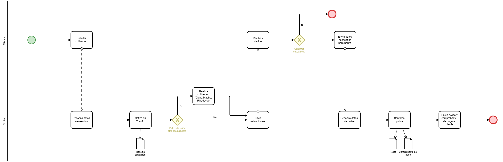

# 02 · Proceso AS-IS

## Descripción del proceso actual

El proceso hoy involucra dos participantes: **Cliente** y **Broker** (en la práctica, Sandra, quien lleva adelante el proceso día a día; Germán aporta la matrícula y el nombre del estudio). Todo el intercambio ocurre por WhatsApp, sin ninguna herramienta de automatización.

### Etapa 1 — Cotización

1. El cliente **solicita una cotización** por WhatsApp, con un mensaje libre (sin formato ni estructura fija)
2. El broker **recopila los datos necesarios** hablando directamente con el cliente, mensaje por mensaje
3. El broker **cotiza en Triunfo**, la aseguradora que se usa por defecto
4. El broker evalúa si el cliente **pide cotización en otra aseguradora**:
   - Si pide otra → **realiza la cotización** también en Digna, Mapfre o Rivadavia (según corresponda)
   - Si no pide otra → sigue directo al siguiente paso
5. El broker **envía la cotización (o cotizaciones)** al cliente

### Etapa 2 — Decisión del cliente

6. El cliente **recibe y decide** si confirma la cotización
7. Se evalúa si el cliente **confirma la cotización**:
   - Si no confirma → el proceso **termina** ahí, sin venta
   - Si confirma → el cliente **envía los datos necesarios para la póliza**

### Etapa 3 — Contratación

8. El broker **recopila los datos de póliza** aportados por el cliente
9. El broker **confirma la póliza** en la web de la aseguradora
10. El broker **envía la póliza y el comprobante de pago** al cliente, cerrando el proceso

## Problema identificado

El cuello de botella está concentrado en el **paso 2** ("Recopila datos necesarios"): mientras el broker no esté disponible para iniciar esa conversación manual, el proceso completo queda detenido. No hay forma de que el cliente avance ni un solo paso sin la presencia activa del broker del otro lado.

Este es el punto exacto que el proceso TO-BE busca resolver (ver `06-proceso-to-be`).
