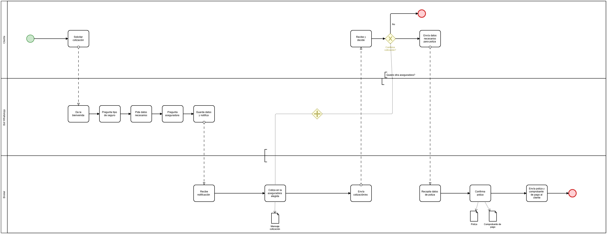

# 06 · Proceso TO-BE

## Descripción del proceso propuesto

El proceso TO-BE incorpora un tercer participante al mismo pool: el **Bot de WhatsApp**, ubicado entre Cliente y Broker. Reemplaza el paso manual de recolección de datos por un flujo automatizado, guiado por botones.

### Etapa 1 — Captación (automatizada)

1. El cliente **solicita una cotización** por WhatsApp, igual que en el AS-IS
2. El bot **da la bienvenida** de forma automática
3. El bot **pregunta el tipo de seguro** (Auto/Moto en este MVP)
4. El bot **pide los datos necesarios**: patente, marca y código postal
5. El bot **pregunta la aseguradora preferida**, mostrando pros y contras si el cliente no tiene una en mente (o asignando Triunfo por defecto si no elige)
6. El bot **guarda los datos y notifica** al broker vía Google Sheets

### Etapa 2 — Cotización (sin cambios en el rol, sin el gateway previo)

7. El broker **recibe la notificación** con todos los datos ya completos
8. El broker **cotiza en la aseguradora elegida** — ya no hay que decidir en el momento si cotizar en otra compañía, porque esa preferencia ya viene definida desde la etapa 1
9. El broker **envía la cotización** al cliente

### Etapa 3 — Decisión del cliente (con una salida más que en el AS-IS)

10. El cliente **recibe y decide**, y ahora tiene tres caminos posibles:
    - **Quiere otra aseguradora** → vuelve al paso 8 (el broker cotiza en la nueva aseguradora elegida), en un loop que se puede repetir tantas veces como el cliente pida
    - **Confirma** → sigue a la contratación
    - **No confirma** → el proceso termina

### Etapa 4 — Contratación (sin cambios respecto al AS-IS)

11. Envía datos necesarios para la póliza → Recopila datos de póliza → Confirma póliza → Envía póliza y comprobante de pago al cliente

## Comparación AS-IS vs TO-BE

| Aspecto | AS-IS | TO-BE |
|---|---|---|
| Recolección de datos | Manual, a cargo del broker, mensaje por mensaje | Automatizada, guiada por el bot con botones |
| Disponibilidad | Depende de que el broker esté online | 24/7, sin depender de nadie |
| Momento de elegir aseguradora | Se decide recién al cotizar (gateway antes de cotizar) | Se define desde el principio, en la etapa de captación |
| Pedido de cotización adicional | Gateway previo a la primera cotización | Loop posterior, después de ver la primera cotización — el cliente compara con datos reales en mano |
| Registro de leads | Informal, disperso en el historial de WhatsApp | Estructurado, centralizado en Google Sheets |
| Etapa de contratación | Manual | Sin cambios — sigue siendo manual en esta versión del proyecto |

## Qué no cambia

Deliberadamente, todo lo que ocurre **después** de que el broker recibe la notificación del bot queda igual que en el AS-IS: cotizar, contratar, emitir la póliza y cobrar siguen siendo tareas 100% manuales de Sandra/Germán en esta etapa del proyecto. El TO-BE ataca puntualmente el cuello de botella identificado, sin tocar el resto del proceso.
